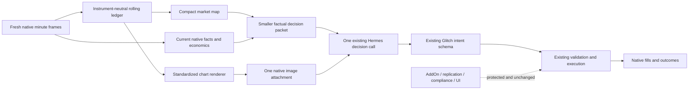

# Glitch cognition market-perception v2

Status: implemented and source-verified in profile v0.0.2.68; install and forward evaluation pending
Date: 2026-09-01
Rail: GHP-001

## Objective

Give Hermes a compact, causally correct view of the current auction so it can recognize, compare, enter, and manage coherent moves sooner without turning Glitch into a deterministic strategy.

The desired product outcome is a better prospective chance of reaching the user-configured daily capture while preserving capital. The operator's estimate of moving from roughly 20% toward 80% is an aspiration to evaluate, not an engineering guarantee, action gate, trade quota, confidence adjustment, or acceptance threshold.

## Evidence behind the change

- The first frozen day produced 13 independent ideas, 4 wins, 9 losses, a 30.8% win rate, profit factor 1.01, and approximately flat net results. Six ideas had no sampled favorable excursion and all four full stopouts had zero favorable excursion. The weakness was entry selection and geometry, not execution mechanics.
- Review of the day's charts showed entries clustering in noise or after useful displacement had already consumed the room. Several coherent transitions, pullbacks, failed breaks, and directional legs were observed but not acted on early.
- The current native packet is authoritative and mechanically healthy, but a representative pre-change model packet still supplied roughly 59,000-60,000 JSON characters, including four repeated historical instrument blocks, before the direct instructions and output template.
- The runtime retains 180 one-minute native frames. Each frame already carries MES, MNQ, and M2K OHLCV, native tick economics, 1/5/15/60-minute observations, session levels, and available order-flow/VWAP facts. The missing layer is bounded temporal and spatial organization, not more raw indicators.
- A prior v0.0.2.18 `market_structure.py` proved that deterministic session continuity is feasible, but it was MNQ-specific and embedded fixed tick distances, thresholds, labels, recent-outcome influence, and strategy-flavored assumptions. It remains unwired and must not be restored unchanged.
- Historical testing did not find a stable literal indicator, color-following, fixed ATR, fixed reward/risk, or named-pattern strategy that generalized across MES, MNQ, M2K, years, and regimes. Support/resistance, VWAP location, repeated tests, order-flow response, and oscillator exhaustion can modify the probability of favorable excursion, but they do not constitute an automatic entry rule.

## Decisions carried forward from the transcript

- Glitch/NinjaTrader remains the deterministic eyes, hands, native truth, execution, replication, and compliance system. Hermes remains the probabilistic brain.
- Deterministic work should offload arithmetic, normalization, time sequence, and spatial organization. It must not offload judgment by becoming an entry strategy or execution gate.
- A good candidate is an early coherent auction move with favorable location, a genuine noise-surviving invalidation, and unconsumed room. A cheap denominator, tiny target, raw indicator agreement, named pattern, or low break-even probability is not an edge by itself.
- Support/resistance, repeated rejection, VWAP location, session levels, RSI exhaustion, order-flow effort versus price result, microstructure transitions, pullbacks, sweeps, and failed acceptance are primitives and probability modifiers. Hermes combines them; no primitive is mandatory or sufficient.
- Anticipatory action remains allowed. Confirmation, acceptance, and retests are evidence, not cumulative prerequisites. Waiting is preferable only when it materially improves location, invalidation cost, or target-before-stop probability before the objective is consumed.
- Current condition-change self-wake semantics remain model-defined. The map may make better levels visible, but deterministic code never arms, suppresses, advances, or replaces a trade hypothesis.
- Position management remains based on remaining expected value, earned favorable excursion, rollback, opposing structure, and supported protection or exit. The new context helps Hermes see those facts; it does not add a trailing-stop formula or automatic profit rule.
- The first implementation uses one better-equipped Hermes call. Multiple instrument or indicator specialist calls would add latency, disagreement, cost, and failure surfaces before a single-call perception bottleneck has been tested.
- A standardized rendered chart is preferable to a NinjaTrader screenshot because it is deterministic, consistently scaled, free of window/layout dependence, and can exclude account/PnL bias.
- Learner history, promotion, and frozen evaluation remain separate. This build adds no retrospective performance KPI, model score, or psychoanalysis loop. Derived values are causal descriptive measurements and native-unit conversions, not strategy metrics.
- After release, cognition is frozen for forward observation unless a confirmed structural defect appears. Wins and losses alone do not authorize prompt tuning.

## Protected system boundary

This is a Hermes cognition-input change only.

Unchanged:

- NinjaTrader AddOn and Indicator source;
- replication, followers, ratios, group scope, and manual-trade behavior;
- compliance, risk, daily close, account limits, and prop-firm rules;
- UI, licensing, API, packaging, and customer downloads;
- model, provider, cadence, AI Auto, market-open/freshness admission, and worker concurrency;
- Glitch intent, forecast, decision-audit, wake-trigger, execution, and receipt schemas;
- deterministic execution validation and latest-price revalidation;
- current entry, position-management, and observational EV cognition;
- learner cadence, promotion gate, memories, epoch history, and evaluation artifacts.

No deterministic component may choose an instrument, direction, setup, action, probability, entry, stop, target, quantity, protection amendment, exit, or veto. Missing or warming evidence is neutral. A daily target never makes a trade valid.

## Architecture

The numerical packet remains authoritative. The chart supplies spatial gestalt only. A disagreement is resolved in favor of the numerical packet and recorded as uncertainty.

## Deterministic perception layer

Replace the internals of the currently unwired `scripts/market_structure.py` with an instrument-neutral v2 module. It consumes only native facts available by the decision time and persists a bounded per-instrument ledger keyed by completed one-minute bar identity.

### Inputs

- the five contiguous frames in the admitted decision packet;
- additional retained minute frames needed to seed or catch up the ledger;
- native `last_completed_bar` as the closed-candle authority;
- the latest partial bar, kept explicitly separate;
- native tick size, point value, session levels, OHLCV, ATR, ADX, RSI, VWAP, and order-flow fields when available;
- native position, entry, stop, target, MFE, MAE, rollback, and protection facts when positioned.

No trade results, PnL streaks, learner verdicts, hindsight labels, or manually drawn annotations enter the market map.

### Outputs

For each eligible instrument, emit bounded measurements rather than an action score:

1. **Price sequence:** recent completed bars, current partial bar, direction-change legs, displacement, overlap, efficiency, and ATR-normalized MFE/MAE of completed legs.
2. **Structure:** causal swing points, higher/lower relations, current microstructure break/reclaim/test/rejection events, and time since each event.
3. **Levels:** clustered swing support/resistance, session and previous-session highs/lows, range high/low/mid, touch and rejection counts, age, and current distance in points, ticks, ATR, and one-contract dollars.
4. **Auction state:** separate evidence for balance, directional persistence, compression, expansion, acceptance, and failure. These remain an evidence vector; code does not collapse them into a strategy label or permission.
5. **VWAP path:** current and recent relationship to the median and available deviation bands, crossings, rejection/acceptance behavior, and slope. Missing VWAP remains unknown.
6. **Order-flow response:** effort versus price result, delta change, absorption/divergence candidates, coverage, reliability, and explicit unavailable status. Missing order flow is never zero.
7. **Geometry facts:** nearest evidence-supported levels above and below with exact distance/cost conversions. Code supplies possible boundaries and destinations, never a bracket, rank, probability, or trade.
8. **Evidence quality:** warm-up depth, source timestamps, partial/completed identity, missing fields, and calculation issues.

Adaptive tolerances may use the instrument's native tick and recent robust noise estimate. Every tolerance is measurement plumbing, visible in the output, symmetric across instruments, and forbidden from admitting or rejecting an intent.

## Visual context

Render from the same native ledger with Pillow; do not capture NinjaTrader windows.

Flat scan or condition-change review:

- one composite image with aligned MES, MNQ, and M2K panels;
- approximately six hours of one-minute candles when the persisted ledger is warm, with available retained history during warm-up;
- raw candle direction colors only;
- VWAP median and available +/-1 and +/-2 bands;
- session and previous-session highs/lows;
- a small bounded set of measured support/resistance clusters with touch counts;
- volume and a compact RSI strip;
- order-flow delta only where native coverage exists;
- the partial current candle visually distinct from completed candles.

Position-management review:

- one larger chart for the native position's instrument;
- entry, current price, native stop, native target, breakeven, MFE, rollback, and measured structural levels;
- no rescan or new-exposure chart for flat instruments.

Never draw account equity, realized PnL, daily-target progress, prior trade arrows, manual annotations, predicted paths, buy/sell labels, setup scores, or preferred actions.

The chart is rendered only for a cycle that has already passed AI Auto, market-session, packet-freshness, contiguity, and feed-self-check admission. It is attached to the same existing Hermes call through native `--image` support. There are no specialist calls. Rendering failure is fail-open to the authoritative text packet and is surfaced as evidence quality; it never blocks or retries a trade decision. Contract-only JSON repair does not need the image a second time. Images have bounded retention.

## Packet and cognition changes

Keep the existing five-frame semantics, current portfolio facts, native economics, current 1/5/15/60-minute context, recent factual ledger, prior cognition, output template, and decision contract.

Reduce repetition by compacting the four non-current frames to their minute identity plus per-instrument current price, one-minute OHLCV, authoritative completed candle, and the small set of time-sequence facts required to preserve the five-minute path. Keep the latest frame authoritative and attach the bounded market map there or beside it. The representative text envelope must be smaller than the current baseline after the map is added; target at least a 25% reduction without deleting a protected fact.

Do not rewrite SOUL, add a strategy skill, add a setup whitelist, or expand the required output. Add at most one compact observation-contract instruction:

> `market_map` and the attached chart organize deterministic historical measurements. They are evidence, not permission; numerical native facts are authoritative, missing data is neutral, and Hermes still owns every scenario, probability, geometry, and action.

Hermes continues to construct competing current, bullish, bearish, and next paths. The improvement is that it receives causal legs, levels, interactions, and spatial context instead of reconstructing them from repetitive snapshots. Named patterns such as head-and-shoulders may be hypotheses recognized by Hermes; they are never deterministic triggers or required archetypes.

## Prospective behavior we want

On each admitted flat decision, Hermes should be able to answer quickly:

- What auction is active and how did price get here?
- Is the current move early, progressing, pulling back, mature, failing, or balancing?
- Where are the nearest genuine invalidation and plausible destination, and what do they cost in native units?
- Is price accepting or rejecting a repeatedly tested level, VWAP region, or session boundary?
- Does order-flow effort produce price progress or absorption?
- Is there an actionable current zone, a concrete pre-objective wait zone, or no positive asymmetry?
- Which instrument has the best current probability-adjusted opportunity after noise, friction, latency, and dollar excursion?

When positioned, the same context should make remaining continuation value, opposing structure, earned excursion, rollback, and profit-protection alternatives spatially obvious without changing the existing management doctrine.

## Diff budget

Implementation is limited to:

- `scripts/market_structure.py` — replace the unwired v1 internals with instrument-neutral causal market-map and chart construction;
- `scripts/run-direct-glitch-cycle.py` — ingest the map, compact repeated historical frames, attach at most one image to the first model attempt, and preserve fail-open behavior;
- `tests/test_market_structure.py` — replace MNQ/fixed-threshold assumptions and cover the v2 measurements;
- `tests/test_direct_cycle_contracts.py` — prove packet preservation, compaction, image invocation, repair behavior, and unchanged output validation;
- one focused chart-render test file only if separating image assertions materially improves clarity;
- `README.md`, `distribution.yaml`, `SHA256SUMS`, and this ledger only at release time.

SOUL and skill files are outside the initial diff budget. They may change only if implementation proves the single observation-contract sentence cannot live cleanly in the direct prompt; any such change requires a separate reviewed hunk.

No NinjaTrader repository file is in scope.

## Proof before installation

1. **Causality:** every derived observation uses only completed bars and facts available at or before the packet close; the current partial bar remains labeled partial.
2. **Instrument neutrality:** the same fixtures pass for MES, MNQ, and M2K using native economics; no symbol-specific distance or preferred instrument exists.
3. **Missing-data neutrality:** unavailable VWAP, order flow, history, or rendering cannot become direction, confidence, veto, or failure of the decision cycle.
4. **Determinism:** identical input and prior state produce byte-identical map JSON and image bytes.
5. **State safety:** ledger catch-up, dedupe, atomic persistence, pruning, restart warm-up, session transition, and corrupt-state recovery are covered.
6. **Packet preservation:** current native market, portfolio, economics, scope, policy, five-minute path, prior cognition, factual ledger, and output template remain semantically present.
7. **Cognitive boundary:** tests reject any map field or prompt text that supplies an action, rank, direction preference, probability, bracket, quantity, veto, strategy score, daily-target rule, or outcome-derived bias.
8. **Visual fidelity:** chart timestamps and prices match the packet; overlays are causal; M2K missing order flow is shown as unavailable; no account/PnL/trade-arrow leakage exists.
9. **Performance:** representative text size decreases at least 25%; render time and image size are bounded; no polling, extra worker, extra LLM call, or unbounded retention is introduced.
10. **Regression:** the full current profile suite, contract-normalization cases, trigger continuity, observational EV, position management, learner promotion, market admission, setup/install integrity, and deterministic replay all pass.
11. **Behavioral replay:** run current and candidate perception against preserved pre-decision packets from good, bad, and NOTHING examples. Compare whether the candidate exposes the relevant structure earlier and preserves current action freedom. This is a blinded cognition check, not retrospective prompt tuning or a profitability claim.
12. **Diff review:** every changed line maps to this rail; all unplanned hunks are removed; the dirty NinjaTrader checkout remains untouched.

## Rollout and rollback

Before replacing deployed cognition, pause through the supported operator control and create a verified checkpoint of installed profile identity, current cognition bundle, learner/epoch evidence, job state, and hashes. No epoch reset is part of this change.

After source tests and complete diff review:

1. commit and push the scoped Hermes change;
2. install through the supported profile deployment path, preserving authentication, configuration overrides, memories, ledgers, cron state, and AI state;
3. verify source, remote, installed distribution, and hashes independently;
4. restore the prior AI/job state;
5. use the next naturally admitted fresh SIM cycle as live proof that map creation, native image attachment, one-call decision delivery, strict JSON, and normal intent handling work;
6. freeze the released cognition for the observation period unless a confirmed structural defect requires rollback.

Rollback is reinstalling the exact pre-change profile commit and verified checkpoint. It must not reset the epoch, delete learning evidence, restart NinjaTrader, or alter replication, compliance, accounts, orders, or positions.

## Definition of done

The work is done only when the scoped source exists, all focused and full tests pass, the complete diff is reviewed, the remote resolves to the intended commit, the installed profile hashes match it, and a fresh admitted runtime cycle proves the market map and image reached the same Hermes call without changing the existing execution contract.

Until then, report implemented, published, installed, and working as separate states. Profitability and an 80% daily-capture rate remain prospective claims requiring frozen forward evidence.

## Source verification

- The focused perception/direct-cycle suite passes 103 tests.
- On a representative live packet, the pre-change model packet was 60,361 characters; the candidate compact packet plus market map was 44,314 characters, a 26.6% reduction.
- The bounded map was 11,053 characters, and the 1400x960 three-instrument chart rendered in approximately 0.23 seconds at approximately 58 KB.
- The full profile regression and installed/live proof remain release gates, not inferred from these focused results.
